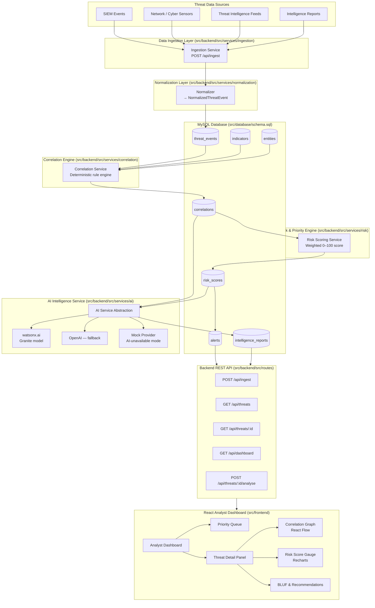

# CyberFusion — Architecture

> **Project:** CyberFusion — AI-powered Threat Intelligence Correlation & Alert Prioritisation Assistant
> **Type:** Hackathon prototype (IBM BoB AI Hackathon)
> **Status:** Architecture approved — implementation in progress

---

## Table of Contents

1. [System Architecture](#1-system-architecture)
2. [Components](#2-components)
3. [Data Flow](#3-data-flow)
4. [Security Considerations](#4-security-considerations)
5. [Scalability Notes](#5-scalability-notes)
6. [Database Schema Summary](#6-database-schema-summary)
7. [Risk Scoring Model](#7-risk-scoring-model)
8. [AI Intelligence Service Contract](#8-ai-intelligence-service-contract)

---

## 1. System Architecture



---

## 2. Components

| Component | Technology | Location | Responsibility |
|---|---|---|---|
| **React Analyst Dashboard** | React 18, Vite, Tailwind CSS | `src/frontend/` | Analyst decision-support UI — priority queue, threat detail, BLUF, correlation graph, risk gauge |
| **Backend REST API** | Node.js 18, Express.js | `src/backend/src/routes/` | REST routing, request validation, orchestration of services |
| **Ingestion Service** | Node.js | `src/backend/src/services/ingestion/` | Accept heterogeneous threat events; route to normalizer |
| **Normalization Service** | Node.js | `src/backend/src/services/normalization/` | Convert source-specific fields to `NormalizedThreatEvent`; persist to `threat_events` |
| **Correlation Engine** | Node.js — deterministic rules | `src/backend/src/services/correlation/` | Group related events by shared IP, target, indicator, temporal proximity, event-type sequence |
| **Risk & Priority Engine** | Node.js — weighted formula | `src/backend/src/services/risk/` | Compute explainable 0–100 priority score; classify LOW / MEDIUM / HIGH / CRITICAL |
| **AI Intelligence Service** | Node.js abstraction + watsonx.ai (Granite) | `src/backend/src/services/ai/` | Provider-agnostic wrapper for BLUF generation, threat assessment, recommended actions |
| **MySQL Database** | MySQL 8+ | `src/database/schema.sql` | Persistent storage for all entities, events, correlations, scores, and AI reports |
| **Demo Seed Data** | Node.js | `src/data/seeds/demo-scenarios.js` | Two reproducible demo scenarios for presentation |

---

## 3. Data Flow

The complete pipeline from raw input to analyst output:

```
1. EVENT ARRIVAL
   A threat event arrives at POST /api/ingest
   (SIEM log, sensor alert, TI indicator, or intelligence report).

2. VALIDATION
   The ingestion service validates the payload structure.
   Invalid events are rejected with a 400 error; no partial writes.

3. NORMALIZATION
   Source-specific field names are mapped to the NormalizedThreatEvent schema:
     SIEM  → { src_ip }          becomes → { source_ip }
     Sensor → { attacker }       becomes → { source_ip }
     TI feed → { indicator }     becomes → { indicator_value }
   The normalized event is persisted to threat_events.

4. IOC MATCHING
   The normalizer checks the indicators table for a match on indicator_value.
   A match sets ioc_matched = true and boosts confidence upstream.

5. CORRELATION
   The correlation engine runs deterministic rules against all recent events:
     Rule R1: Same source_ip    → group events from the same attacker address
     Rule R2: Same target       → group events against the same asset
     Rule R3: IOC match         → link events sharing a known-bad indicator
     Rule R4: Temporal window   → events within a configurable time window
     Rule R5: Event-type chain  → e.g. port_scan → failed_login → ioc_match
   Matched events are written to correlations + correlation_events.

6. RISK SCORING
   The risk engine calculates a weighted score for each correlation:
     severity_component          (30 pts max) — highest severity among events
     ioc_match_component         (25 pts max) — whether IOC match exists
     asset_criticality_component (20 pts max) — entities.criticality of target
     correlation_strength_component (15 pts max) — number of rules that fired
     recency_component           (10 pts max) — decay based on event age
   Total 0–100 → classified as LOW / MEDIUM / HIGH / CRITICAL.
   Score + breakdown written to risk_scores; high/critical triggers an alert.

7. AI ANALYSIS (on demand or triggered by CRITICAL score)
   The backend calls the AI Intelligence Service with structured evidence:
     - Correlation summary
     - Event list with normalised fields
     - Risk score breakdown
     - Matched indicator details
     - Asset criticality metadata
   The AI (watsonx.ai Granite by default) returns:
     - BLUF (Bottom Line Up Front) — one-paragraph commander summary
     - Threat assessment
     - Possible intent
     - Reasoning over the evidence
     - Recommended actions
   The AI response is validated (required fields present, length bounds checked)
   before being written to intelligence_reports.
   If the AI provider is unavailable, the application continues to function
   with deterministic risk data; the UI shows an "AI analysis unavailable" state.

8. API RESPONSE
   GET /api/dashboard   — returns priority-ordered alert list with risk scores
   GET /api/threats/:id — returns full correlation detail, risk breakdown,
                          intelligence report (if generated), event list
   POST /api/threats/:id/analyse — triggers AI analysis for a correlation

9. DASHBOARD RENDERING
   The React frontend polls or requests data via REST.
   The analyst sees:
     - Priority Queue (CRITICAL → HIGH → MEDIUM → LOW)
     - Statistics bar (counts by priority)
     - Threat detail panel on selection:
         - Risk score gauge (Recharts)
         - Correlation graph (React Flow)
         - Evidence list
         - BLUF panel
         - Recommended actions
     - System status (AI provider available / unavailable)
```

---

## 4. Security Considerations

### Secret Management

- All credentials (database, AI provider API keys) are stored in environment variables loaded via `dotenv`.
- No secret is hardcoded in source code.
- `src/.env.example` provides a safe template with dummy values.
- The `.gitignore` already excludes `.env`, `.env.local`, `.env.production`.
- **AI credentials are never exposed to the React frontend.** All AI calls are made server-side. The frontend only receives `VITE_API_BASE_URL` as a build-time variable.

### Input Validation

- All inbound API requests are validated using `express-validator` before processing.
- Ingest payloads are checked for required fields, type correctness, and size limits.
- Invalid or oversized inputs are rejected before reaching the normalization layer.

### AI Response Validation

- AI responses are validated for required fields (`bluf`, `recommended_actions`) and length bounds before being written to the database or returned to the client.
- If the AI returns a malformed or empty response, the system falls back to the deterministic risk data and logs a warning.

### API Security

- API routes are protected by CORS configuration restricting allowed origins to the frontend origin.
- No authentication is implemented in the hackathon prototype (noted as a known limitation).
- Database error messages are never exposed in HTTP responses. Generic error messages are returned to clients; full errors are logged server-side only.

### Database Credentials

- Database connection parameters come exclusively from environment variables (`DB_HOST`, `DB_PORT`, `DB_NAME`, `DB_USER`, `DB_PASSWORD`).
- No connection string containing credentials appears in source code.
- Database error details are captured in server-side logs and suppressed from API error responses.

### No Classified Data

- This prototype uses simulated and publicly available threat intelligence data only.
- No classified, restricted, or real operational intelligence is used or claimed.

---

## 5. Scalability Notes

The prototype is intentionally a single-process Node.js backend. The architecture is structured so that each service module can be separated without rewriting the business logic:

| Layer | Hackathon state | Future scaling path |
|---|---|---|
| Ingestion | In-process function called by the route handler | Extract to a queue consumer (e.g., IBM MQ, Kafka); decouple ingest rate from API rate |
| Normalization | Synchronous pipeline step | Can be parallelised or run as a worker thread pool |
| Correlation | In-process rule engine over recent events in MySQL | Promote to a streaming processor (e.g., Apache Flink) for real-time large-scale correlation |
| Risk Scoring | Pure function, stateless | Already horizontally scalable; weights could be externalised to a config service |
| AI Service | Single-request REST call to provider | Add request queuing and caching of reports to avoid redundant model calls |
| MySQL | Single instance | Add read replicas for dashboard query load; partition `threat_events` by timestamp for large volumes |
| Backend API | Single Express process | Stateless; can be containerised and placed behind a load balancer immediately |
| Frontend | Vite SPA | Deploy as static assets (CDN); no scaling concern |

The primary bottleneck at scale is the AI inference call (synchronous, relatively slow). Adding an async job queue for AI analysis is the highest-priority architectural change after the hackathon.

---

## 6. Database Schema Summary

| Table | Purpose | Key relationships |
|---|---|---|
| `threat_events` | One row per normalised event regardless of source | — |
| `indicators` | Known-bad IOCs from TI feeds | Matched during normalization |
| `entities` | High-value assets with criticality scores | Looked up by `target` during risk scoring |
| `correlations` | A logical group of related events | Has many `threat_events` via `correlation_events` |
| `correlation_events` | Join table | `correlations` ↔ `threat_events` |
| `risk_scores` | Weighted score per correlation | One-to-one with `correlations` |
| `alerts` | Analyst-facing alerts for high/critical correlations | Belongs to `correlations` |
| `intelligence_reports` | AI-generated BLUF and recommendations | One-to-one with `correlations` |

Full DDL: [`src/database/schema.sql`](../src/database/schema.sql)

---

## 7. Risk Scoring Model

Priority score is calculated from five deterministic, configurable components:

```
score = severity_component
      + ioc_match_component
      + asset_criticality_component
      + correlation_strength_component
      + recency_component
```

| Component | Max pts | Default weight | Calculation |
|---|---|---|---|
| `severity_component` | 30 | 30% | Highest severity across correlated events: critical=30, high=22, medium=14, low=6 |
| `ioc_match_component` | 25 | 25% | 25 if any event has an IOC match; 0 otherwise |
| `asset_criticality_component` | 20 | 20% | `entities.criticality × 0.20` (0 if target not in entities) |
| `correlation_strength_component` | 15 | 15% | `min(rules_fired, 5) × 3` — each distinct correlation rule adds 3 pts |
| `recency_component` | 10 | 10% | Linear decay: 10 pts if event < 15 min ago, 0 pts if > 24 h ago |

**Priority classification:**

| Score | Priority |
|---|---|
| 0–30 | LOW |
| 31–60 | MEDIUM |
| 61–80 | HIGH |
| 81–100 | CRITICAL |

Default weights are defined in `src/backend/src/services/risk/risk.config.js` and can be overridden via environment variables (`RISK_WEIGHT_*`).

---

## 8. AI Intelligence Service Contract

The AI service receives a structured `CorrelationContext` object (never raw log streams):

```json
{
  "correlation_id": "uuid",
  "title": "Coordinated attack against prod-db-01.internal",
  "event_count": 4,
  "risk_score": 92,
  "priority": "critical",
  "correlation_factors": ["same_source_ip", "same_target", "ioc_match", "event_type_chain"],
  "events": [
    {
      "event_type": "port_scan",
      "source_ip": "185.220.101.47",
      "target": "prod-db-01.internal",
      "severity": "medium",
      "timestamp": "2025-01-01T10:00:00Z"
    }
  ],
  "matched_indicators": [
    {
      "indicator_value": "185.220.101.47",
      "threat_type": "botnet_c2",
      "confidence": 95
    }
  ],
  "target_entity": {
    "name": "prod-db-01.internal",
    "criticality": 95,
    "description": "Primary production database server"
  }
}
```

The AI service must return a validated `IntelligenceReport` object:

```json
{
  "bluf": "CRITICAL: ...",
  "threat_assessment": "...",
  "possible_intent": "...",
  "reasoning": "...",
  "evidence_summary": "...",
  "recommended_actions": ["action 1", "action 2"],
  "confidence_score": 88
}
```

Phase 5 builds a whitelist-based intelligence context, validates the complete seven-field response contract, and checks it against authoritative evidence before persisting it. The provider is selected via `AI_PROVIDER`; the current configured provider is Groq. If the provider is unavailable, returns invalid output, or fails guardrails, the service persists a clearly labelled deterministic fallback report (`ai_provider: "fallback"`) without changing the authoritative correlation or risk result.
